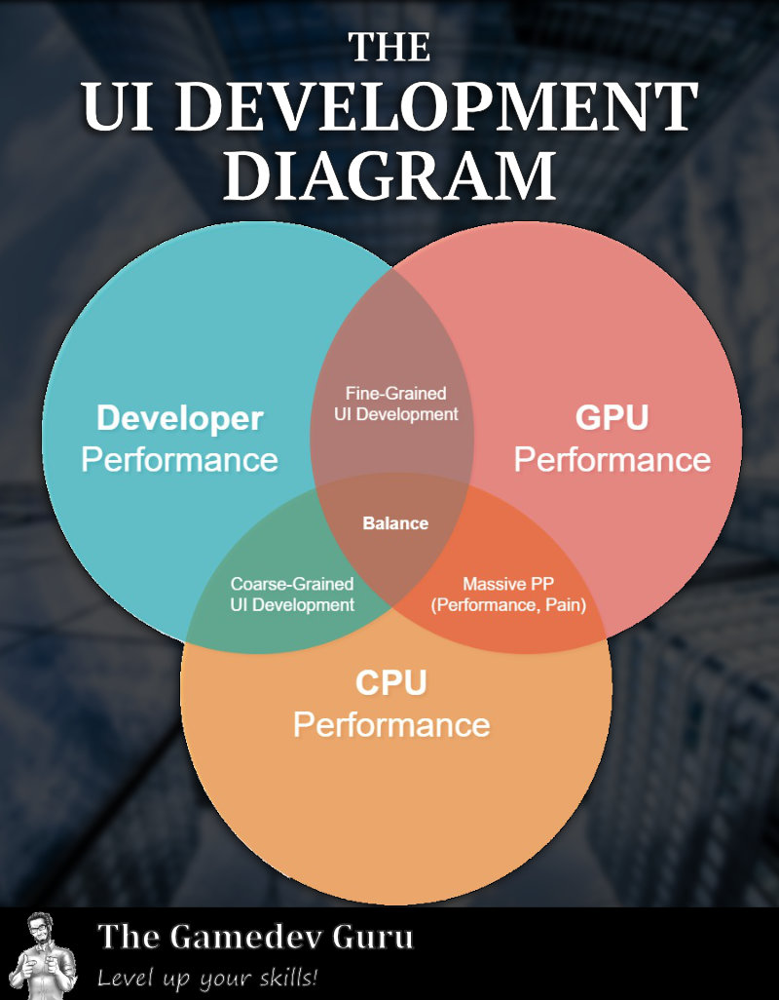

# The Gamedev Guru's Unity UI Development Triangle

Are you curious about different **high-performing UI Development Approaches** in Unity?

Or maybe you are in the middle of a **performance** mess and need some inspiration?

This project will, along the article posted at [**thegamedev.guru**](https://thegamedev.guru/the-ui-development-triangle/), help you getting a quick overview on different techniques you may apply while designing and/or optimizing the user interfaces of your games.

